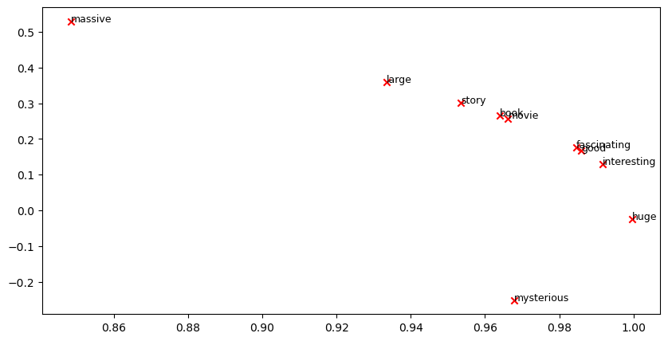

- Name: **Rahmatollah Ansari**
- Student ID: **404722028**
- email: **rahmat.ansari.dev@gmail.com**
- website: **[rahmat-ml.github.io](https://rahmat-ml.github.io)**

# CS224N Assignment 1: Exploring Word Vectors (25 Points)
### <font color='blue'> Due 4:30pm, Tue April 9th 2024</font>

Welcome to CS224N! 

Before you start, make sure you **read the README.md** in the same directory as this notebook for important setup information. You need to install some Python libraries before you can successfully do this assignment. A lot of code is provided in this notebook, and we highly encourage you to read and understand it as part of the learning :)

If you aren't super familiar with Python, Numpy, or Matplotlib, we recommend you check out the review session on Friday. The session will be recorded and the material will be made available on our [website](http://web.stanford.edu/class/cs224n/index.html#schedule). The CS231N Python/Numpy [tutorial](https://cs231n.github.io/python-numpy-tutorial/) is also a great resource.


**Assignment Notes:** Please make sure to save the notebook as you go along. Submission Instructions are located at the bottom of the notebook.


```python
# All Import Statements Defined Here
# Note: Do not add to this list.
# ----------------

import sys
assert sys.version_info[0] == 3
assert sys.version_info[1] >= 8

from platform import python_version
assert int(python_version().split(".")[1]) >= 5, "Please upgrade your Python version following the instructions in \
    the README.md file found in the same directory as this notebook. Your Python version is " + python_version()

from gensim.models import KeyedVectors
from gensim.test.utils import datapath
import pprint
import matplotlib.pyplot as plt
plt.rcParams['figure.figsize'] = [10, 5]

from datasets import load_dataset
imdb_dataset = load_dataset("stanfordnlp/imdb")

import re
import numpy as np
import random
import scipy as sp
from sklearn.decomposition import TruncatedSVD
from sklearn.decomposition import PCA

START_TOKEN = '<START>'
END_TOKEN = '<END>'
NUM_SAMPLES = 150

np.random.seed(0)
random.seed(0)
# ----------------
```


```python
imdb_dataset.shape
```


    {'train': (25000, 2), 'test': (25000, 2), 'unsupervised': (50000, 2)}


## Word Vectors

Word Vectors are often used as a fundamental component for downstream NLP tasks, e.g. question answering, text generation, translation, etc., so it is important to build some intuitions as to their strengths and weaknesses. Here, you will explore two types of word vectors: those derived from *co-occurrence matrices*, and those derived via *GloVe*. 

**Note on Terminology:** The terms "word vectors" and "word embeddings" are often used interchangeably. The term "embedding" refers to the fact that we are encoding aspects of a word's meaning in a lower dimensional space. As [Wikipedia](https://en.wikipedia.org/wiki/Word_embedding) states, "*conceptually it involves a mathematical embedding from a space with one dimension per word to a continuous vector space with a much lower dimension*".

## Part 1: Count-Based Word Vectors (10 points)

Most word vector models start from the following idea:

*You shall know a word by the company it keeps ([Firth, J. R. 1957:11](https://en.wikipedia.org/wiki/John_Rupert_Firth))*

Many word vector implementations are driven by the idea that similar words, i.e., (near) synonyms, will be used in similar contexts. As a result, similar words will often be spoken or written along with a shared subset of words, i.e., contexts. By examining these contexts, we can try to develop embeddings for our words. With this intuition in mind, many "old school" approaches to constructing word vectors relied on word counts. Here we elaborate upon one of those strategies, *co-occurrence matrices* (for more information, see [here](https://web.stanford.edu/~jurafsky/slp3/6.pdf) or [here](https://web.archive.org/web/20190530091127/https://medium.com/data-science-group-iitr/word-embedding-2d05d270b285)).

### Co-Occurrence

A co-occurrence matrix counts how often things co-occur in some environment. Given some word $w_i$ occurring in the document, we consider the *context window* surrounding $w_i$. Supposing our fixed window size is $n$, then this is the $n$ preceding and $n$ subsequent words in that document, i.e. words $w_{i-n} \dots w_{i-1}$ and $w_{i+1} \dots w_{i+n}$. We build a *co-occurrence matrix* $M$, which is a symmetric word-by-word matrix in which $M_{ij}$ is the number of times $w_j$ appears inside $w_i$'s window among all documents.

**Example: Co-Occurrence with Fixed Window of n=1**:

Document 1: "all that glitters is not gold"

Document 2: "all is well that ends well"


|     *    | `<START>` | all | that | glitters | is   | not  | gold  | well | ends | `<END>` |
|----------|-------|-----|------|----------|------|------|-------|------|------|-----|
| `<START>`    | 0     | 2   | 0    | 0        | 0    | 0    | 0     | 0    | 0    | 0   |
| all      | 2     | 0   | 1    | 0        | 1    | 0    | 0     | 0    | 0    | 0   |
| that     | 0     | 1   | 0    | 1        | 0    | 0    | 0     | 1    | 1    | 0   |
| glitters | 0     | 0   | 1    | 0        | 1    | 0    | 0     | 0    | 0    | 0   |
| is       | 0     | 1   | 0    | 1        | 0    | 1    | 0     | 1    | 0    | 0   |
| not      | 0     | 0   | 0    | 0        | 1    | 0    | 1     | 0    | 0    | 0   |
| gold     | 0     | 0   | 0    | 0        | 0    | 1    | 0     | 0    | 0    | 1   |
| well     | 0     | 0   | 1    | 0        | 1    | 0    | 0     | 0    | 1    | 1   |
| ends     | 0     | 0   | 1    | 0        | 0    | 0    | 0     | 1    | 0    | 0   |
| `<END>`      | 0     | 0   | 0    | 0        | 0    | 0    | 1     | 1    | 0    | 0   |

In NLP, we commonly use `<START>` and `<END>` tokens to mark the beginning and end of sentences, paragraphs, or documents. These tokens are included in co-occurrence counts, encapsulating each document, for example: "`<START>` All that glitters is not gold `<END>`".

The matrix rows (or columns) provide word vectors based on word-word co-occurrence, but they can be large. To reduce dimensionality, we employ Singular Value Decomposition (SVD), akin to PCA, selecting the top $k$ principal components. The SVD process decomposes the co-occurrence matrix $A$ into singular values in the diagonal $S$ matrix and new, shorter word vectors in $U_k$.

This dimensionality reduction maintains semantic relationships; for instance, *doctor* and *hospital* will be closer than *doctor* and *dog*.

For those unfamiliar with eigenvalues and SVD, a beginner-friendly introduction to SVD is available [here](https://davetang.org/file/Singular_Value_Decomposition_Tutorial.pdf). Additional resources for in-depth understanding include lectures [7](https://web.stanford.edu/class/cs168/l/l7.pdf), [8](http://theory.stanford.edu/~tim/s15/l/l8.pdf), and [9](https://web.stanford.edu/class/cs168/l/l9.pdf) of CS168, providing high-level treatment of these algorithms. For practical implementation, utilizing pre-programmed functions from Python packages like numpy, scipy, or sklearn is recommended. While applying full SVD to large corpora can be memory-intensive, scalable techniques such as Truncated SVD exist for extracting the top $k$ vector components efficiently.

### Plotting Co-Occurrence Word Embeddings

Here, we will be using the Large Movie Review Dataset. This is a dataset for binary sentiment classification containing substantially more data than previous benchmark datasets. We provide a set of 25,000 highly polar movie reviews for training, and 25,000 for testing. There is additional unlabeled data for use as well. We provide a `read_corpus` function below that pulls out the text of a movie review from the dataset. The function also adds `<START>` and `<END>` tokens to each of the documents, and lowercases words. You do **not** have to perform any other kind of pre-processing.


```python
imdb_dataset['train']['text'][0]
```


    'I rented I AM CURIOUS-YELLOW from my video store because of all the controversy that surrounded it when it was first released in 1967. I also heard that at first it was seized by U.S. customs if it ever tried to enter this country, therefore being a fan of films considered "controversial" I really had to see this for myself.<br /><br />The plot is centered around a young Swedish drama student named Lena who wants to learn everything she can about life. In particular she wants to focus her attentions to making some sort of documentary on what the average Swede thought about certain political issues such as the Vietnam War and race issues in the United States. In between asking politicians and ordinary denizens of Stockholm about their opinions on politics, she has sex with her drama teacher, classmates, and married men.<br /><br />What kills me about I AM CURIOUS-YELLOW is that 40 years ago, this was considered pornographic. Really, the sex and nudity scenes are few and far between, even then it\'s not shot like some cheaply made porno. While my countrymen mind find it shocking, in reality sex and nudity are a major staple in Swedish cinema. Even Ingmar Bergman, arguably their answer to good old boy John Ford, had sex scenes in his films.<br /><br />I do commend the filmmakers for the fact that any sex shown in the film is shown for artistic purposes rather than just to shock people and make money to be shown in pornographic theaters in America. I AM CURIOUS-YELLOW is a good film for anyone wanting to study the meat and potatoes (no pun intended) of Swedish cinema. But really, this film doesn\'t have much of a plot.'


```python
def read_corpus():
    """ Read files from the Large Movie Review Dataset.
        Params:
            category (string): category name
        Return:
            list of lists, with words from each of the processed files
    """
    files = imdb_dataset["train"]["text"][:NUM_SAMPLES]
    return [[START_TOKEN] + [re.sub(r'[^\w]', '', w.lower()) for w in f.split(" ")] + [END_TOKEN] for f in files]

```

Let's have a look what these documents are like….


```python
imdb_corpus = read_corpus()
pprint.pprint(imdb_corpus[:3], compact=True, width=100)
print("corpus size: ", len(imdb_corpus[0]))
```

    [['<START>', 'i', 'rented', 'i', 'am', 'curiousyellow', 'from', 'my', 'video', 'store', 'because',
      'of', 'all', 'the', 'controversy', 'that', 'surrounded', 'it', 'when', 'it', 'was', 'first',
      'released', 'in', '1967', 'i', 'also', 'heard', 'that', 'at', 'first', 'it', 'was', 'seized',
      'by', 'us', 'customs', 'if', 'it', 'ever', 'tried', 'to', 'enter', 'this', 'country', 'therefore',
      'being', 'a', 'fan', 'of', 'films', 'considered', 'controversial', 'i', 'really', 'had', 'to',
      'see', 'this', 'for', 'myselfbr', 'br', 'the', 'plot', 'is', 'centered', 'around', 'a', 'young',
      'swedish', 'drama', 'student', 'named', 'lena', 'who', 'wants', 'to', 'learn', 'everything',
      'she', 'can', 'about', 'life', 'in', 'particular', 'she', 'wants', 'to', 'focus', 'her',
      'attentions', 'to', 'making', 'some', 'sort', 'of', 'documentary', 'on', 'what', 'the', 'average',
      'swede', 'thought', 'about', 'certain', 'political', 'issues', 'such', 'as', 'the', 'vietnam',
      'war', 'and', 'race', 'issues', 'in', 'the', 'united', 'states', 'in', 'between', 'asking',
      'politicians', 'and', 'ordinary', 'denizens', 'of', 'stockholm', 'about', 'their', 'opinions',
      'on', 'politics', 'she', 'has', 'sex', 'with', 'her', 'drama', 'teacher', 'classmates', 'and',
      'married', 'menbr', 'br', 'what', 'kills', 'me', 'about', 'i', 'am', 'curiousyellow', 'is',
      'that', '40', 'years', 'ago', 'this', 'was', 'considered', 'pornographic', 'really', 'the', 'sex',
      'and', 'nudity', 'scenes', 'are', 'few', 'and', 'far', 'between', 'even', 'then', 'its', 'not',
      'shot', 'like', 'some', 'cheaply', 'made', 'porno', 'while', 'my', 'countrymen', 'mind', 'find',
      'it', 'shocking', 'in', 'reality', 'sex', 'and', 'nudity', 'are', 'a', 'major', 'staple', 'in',
      'swedish', 'cinema', 'even', 'ingmar', 'bergman', 'arguably', 'their', 'answer', 'to', 'good',
      'old', 'boy', 'john', 'ford', 'had', 'sex', 'scenes', 'in', 'his', 'filmsbr', 'br', 'i', 'do',
      'commend', 'the', 'filmmakers', 'for', 'the', 'fact', 'that', 'any', 'sex', 'shown', 'in', 'the',
      'film', 'is', 'shown', 'for', 'artistic', 'purposes', 'rather', 'than', 'just', 'to', 'shock',
      'people', 'and', 'make', 'money', 'to', 'be', 'shown', 'in', 'pornographic', 'theaters', 'in',
      'america', 'i', 'am', 'curiousyellow', 'is', 'a', 'good', 'film', 'for', 'anyone', 'wanting',
      'to', 'study', 'the', 'meat', 'and', 'potatoes', 'no', 'pun', 'intended', 'of', 'swedish',
      'cinema', 'but', 'really', 'this', 'film', 'doesnt', 'have', 'much', 'of', 'a', 'plot', '<END>'],
     ['<START>', 'i', 'am', 'curious', 'yellow', 'is', 'a', 'risible', 'and', 'pretentious', 'steaming',
      'pile', 'it', 'doesnt', 'matter', 'what', 'ones', 'political', 'views', 'are', 'because', 'this',
      'film', 'can', 'hardly', 'be', 'taken', 'seriously', 'on', 'any', 'level', 'as', 'for', 'the',
      'claim', 'that', 'frontal', 'male', 'nudity', 'is', 'an', 'automatic', 'nc17', 'that', 'isnt',
      'true', 'ive', 'seen', 'rrated', 'films', 'with', 'male', 'nudity', 'granted', 'they', 'only',
      'offer', 'some', 'fleeting', 'views', 'but', 'where', 'are', 'the', 'rrated', 'films', 'with',
      'gaping', 'vulvas', 'and', 'flapping', 'labia', 'nowhere', 'because', 'they', 'dont', 'exist',
      'the', 'same', 'goes', 'for', 'those', 'crappy', 'cable', 'shows', 'schlongs', 'swinging', 'in',
      'the', 'breeze', 'but', 'not', 'a', 'clitoris', 'in', 'sight', 'and', 'those', 'pretentious',
      'indie', 'movies', 'like', 'the', 'brown', 'bunny', 'in', 'which', 'were', 'treated', 'to', 'the',
      'site', 'of', 'vincent', 'gallos', 'throbbing', 'johnson', 'but', 'not', 'a', 'trace', 'of',
      'pink', 'visible', 'on', 'chloe', 'sevigny', 'before', 'crying', 'or', 'implying',
      'doublestandard', 'in', 'matters', 'of', 'nudity', 'the', 'mentally', 'obtuse', 'should', 'take',
      'into', 'account', 'one', 'unavoidably', 'obvious', 'anatomical', 'difference', 'between', 'men',
      'and', 'women', 'there', 'are', 'no', 'genitals', 'on', 'display', 'when', 'actresses', 'appears',
      'nude', 'and', 'the', 'same', 'cannot', 'be', 'said', 'for', 'a', 'man', 'in', 'fact', 'you',
      'generally', 'wont', 'see', 'female', 'genitals', 'in', 'an', 'american', 'film', 'in',
      'anything', 'short', 'of', 'porn', 'or', 'explicit', 'erotica', 'this', 'alleged',
      'doublestandard', 'is', 'less', 'a', 'double', 'standard', 'than', 'an', 'admittedly',
      'depressing', 'ability', 'to', 'come', 'to', 'terms', 'culturally', 'with', 'the', 'insides',
      'of', 'womens', 'bodies', '<END>'],
     ['<START>', 'if', 'only', 'to', 'avoid', 'making', 'this', 'type', 'of', 'film', 'in', 'the',
      'future', 'this', 'film', 'is', 'interesting', 'as', 'an', 'experiment', 'but', 'tells', 'no',
      'cogent', 'storybr', 'br', 'one', 'might', 'feel', 'virtuous', 'for', 'sitting', 'thru', 'it',
      'because', 'it', 'touches', 'on', 'so', 'many', 'important', 'issues', 'but', 'it', 'does', 'so',
      'without', 'any', 'discernable', 'motive', 'the', 'viewer', 'comes', 'away', 'with', 'no', 'new',
      'perspectives', 'unless', 'one', 'comes', 'up', 'with', 'one', 'while', 'ones', 'mind', 'wanders',
      'as', 'it', 'will', 'invariably', 'do', 'during', 'this', 'pointless', 'filmbr', 'br', 'one',
      'might', 'better', 'spend', 'ones', 'time', 'staring', 'out', 'a', 'window', 'at', 'a', 'tree',
      'growingbr', 'br', '', '<END>']]
    corpus size:  290
    

### Question 1.1: Implement `distinct_words` [code] (2 points)

Write a method to work out the distinct words (word types) that occur in the corpus.

You can use `for` loops to process the input `corpus` (a list of list of strings), but try using Python list comprehensions (which are generally faster). In particular, [this](https://coderwall.com/p/rcmaea/flatten-a-list-of-lists-in-one-line-in-python) may be useful to flatten a list of lists. If you're not familiar with Python list comprehensions in general, here's [more information](https://python-3-patterns-idioms-test.readthedocs.io/en/latest/Comprehensions.html).

Your returned `corpus_words` should be sorted. You can use python's `sorted` function for this.

You may find it useful to use [Python sets](https://www.w3schools.com/python/python_sets.asp) to remove duplicate words.


```python
def distinct_words(corpus):
    """ Determine a list of distinct words for the corpus.
        Params:
            corpus (list of list of strings): corpus of documents
        Return:
            corpus_words (list of strings): sorted list of distinct words across the corpus
            n_corpus_words (integer): number of distinct words across the corpus
    """
    corpus_words = []
    n_corpus_words = -1

    # ------------------
    dw = set()
    for review in corpus:
        for word in review:
            dw.add(word)
    corpus_words = sorted(dw)
    n_corpus_words = len(corpus_words)
    
    # ------------------

    return corpus_words, n_corpus_words
```


```python
distinct_words([["hi", "my", "name", "is", "rahmat"], ["hi", "your", "name", "is", "hamed"]])
```


    (['hamed', 'hi', 'is', 'my', 'name', 'rahmat', 'your'], 7)


```python
# ---------------------
# Run this sanity check
# Note that this not an exhaustive check for correctness.
# ---------------------

# Define toy corpus
test_corpus = ["{} All that glitters isn't gold {}".format(START_TOKEN, END_TOKEN).split(" "), "{} All's well that ends well {}".format(START_TOKEN, END_TOKEN).split(" ")]
test_corpus_words, num_corpus_words = distinct_words(test_corpus)

# Correct answers
ans_test_corpus_words = sorted([START_TOKEN, "All", "ends", "that", "gold", "All's", "glitters", "isn't", "well", END_TOKEN])
ans_num_corpus_words = len(ans_test_corpus_words)

# Test correct number of words
assert(num_corpus_words == ans_num_corpus_words), "Incorrect number of distinct words. Correct: {}. Yours: {}".format(ans_num_corpus_words, num_corpus_words)

# Test correct words
assert (test_corpus_words == ans_test_corpus_words), "Incorrect corpus_words.\nCorrect: {}\nYours:   {}".format(str(ans_test_corpus_words), str(test_corpus_words))

# Print Success
print ("-" * 80)
print("Passed All Tests!")
print ("-" * 80)
```

    --------------------------------------------------------------------------------
    Passed All Tests!
    --------------------------------------------------------------------------------
    

### Question 1.2: Implement `compute_co_occurrence_matrix` [code] (3 points)

Write a method that constructs a co-occurrence matrix for a certain window-size $n$ (with a default of 4), considering words $n$ before and $n$ after the word in the center of the window. Here, we start to use `numpy (np)` to represent vectors, matrices, and tensors. If you're not familiar with NumPy, there's a NumPy tutorial in the second half of this cs231n [Python NumPy tutorial](http://cs231n.github.io/python-numpy-tutorial/).


```python
def compute_co_occurrence_matrix(corpus, window_size=4):
    """ Compute co-occurrence matrix for the given corpus and window_size (default of 4).
    
        Note: Each word in a document should be at the center of a window. Words near edges will have a smaller
              number of co-occurring words.
              
              For example, if we take the document "<START> All that glitters is not gold <END>" with window size of 4,
              "All" will co-occur with "<START>", "that", "glitters", "is", and "not".
    
        Params:
            corpus (list of list of strings): corpus of documents
            window_size (int): size of context window
        Return:
            M (a symmetric numpy matrix of shape (number of unique words in the corpus , number of unique words in the corpus)): 
                Co-occurence matrix of word counts. 
                The ordering of the words in the rows/columns should be the same as the ordering of the words given by the distinct_words function.
            word2ind (dict): dictionary that maps word to index (i.e. row/column number) for matrix M.
    """
    words, n_words = distinct_words(corpus)
    M = None
    word2ind = {}
    
    # ------------------
    word2ind = dict(zip(words, range(n_words)))
    M = np.zeros((n_words, n_words))
    for review in corpus:
        for c_idx, c_word in enumerate(review):
            for o_idx in range(max(0, c_idx - window_size), min(len(review), c_idx + window_size + 1)):
                if o_idx == c_idx:
                    continue
                o_word = review[o_idx]
                M[word2ind[c_word]][word2ind[o_word]] += 1
    # ------------------

    return M, word2ind
```


```python
test_corpus = ["{} All that glitters isn't gold {}".format(START_TOKEN, END_TOKEN).split(" "), "{} All's well that ends well {}".format(START_TOKEN, END_TOKEN).split(" ")]
M_test, word2ind_test = compute_co_occurrence_matrix(test_corpus, window_size=1)
```


```python
M_test
```


    array([[0., 0., 0., 0., 0., 0., 1., 0., 0., 1.],
           [0., 0., 1., 1., 0., 0., 0., 0., 0., 0.],
           [0., 1., 0., 0., 0., 0., 0., 0., 1., 0.],
           [0., 1., 0., 0., 0., 0., 0., 0., 0., 1.],
           [0., 0., 0., 0., 0., 0., 0., 0., 1., 1.],
           [0., 0., 0., 0., 0., 0., 0., 1., 1., 0.],
           [1., 0., 0., 0., 0., 0., 0., 1., 0., 0.],
           [0., 0., 0., 0., 0., 1., 1., 0., 0., 0.],
           [0., 0., 1., 0., 1., 1., 0., 0., 0., 1.],
           [1., 0., 0., 1., 1., 0., 0., 0., 1., 0.]])


```python
word2ind_test
```


    {'<END>': 0,
     '<START>': 1,
     'All': 2,
     "All's": 3,
     'ends': 4,
     'glitters': 5,
     'gold': 6,
     "isn't": 7,
     'that': 8,
     'well': 9}


```python
# ---------------------
# Run this sanity check
# Note that this is not an exhaustive check for correctness.
# ---------------------

# Define toy corpus and get student's co-occurrence matrix
test_corpus = ["{} All that glitters isn't gold {}".format(START_TOKEN, END_TOKEN).split(" "), "{} All's well that ends well {}".format(START_TOKEN, END_TOKEN).split(" ")]
M_test, word2ind_test = compute_co_occurrence_matrix(test_corpus, window_size=1)

# Correct M and word2ind
M_test_ans = np.array( 
    [[0., 0., 0., 0., 0., 0., 1., 0., 0., 1.,],
     [0., 0., 1., 1., 0., 0., 0., 0., 0., 0.,],
     [0., 1., 0., 0., 0., 0., 0., 0., 1., 0.,],
     [0., 1., 0., 0., 0., 0., 0., 0., 0., 1.,],
     [0., 0., 0., 0., 0., 0., 0., 0., 1., 1.,],
     [0., 0., 0., 0., 0., 0., 0., 1., 1., 0.,],
     [1., 0., 0., 0., 0., 0., 0., 1., 0., 0.,],
     [0., 0., 0., 0., 0., 1., 1., 0., 0., 0.,],
     [0., 0., 1., 0., 1., 1., 0., 0., 0., 1.,],
     [1., 0., 0., 1., 1., 0., 0., 0., 1., 0.,]]
)
ans_test_corpus_words = sorted([START_TOKEN, "All", "ends", "that", "gold", "All's", "glitters", "isn't", "well", END_TOKEN])
word2ind_ans = dict(zip(ans_test_corpus_words, range(len(ans_test_corpus_words))))

# Test correct word2ind
assert (word2ind_ans == word2ind_test), "Your word2ind is incorrect:\nCorrect: {}\nYours: {}".format(word2ind_ans, word2ind_test)

# Test correct M shape
assert (M_test.shape == M_test_ans.shape), "M matrix has incorrect shape.\nCorrect: {}\nYours: {}".format(M_test.shape, M_test_ans.shape)

# Test correct M values
for w1 in word2ind_ans.keys():
    idx1 = word2ind_ans[w1]
    for w2 in word2ind_ans.keys():
        idx2 = word2ind_ans[w2]
        student = M_test[idx1, idx2]
        correct = M_test_ans[idx1, idx2]
        if student != correct:
            print("Correct M:")
            print(M_test_ans)
            print("Your M: ")
            print(M_test)
            raise AssertionError("Incorrect count at index ({}, {})=({}, {}) in matrix M. Yours has {} but should have {}.".format(idx1, idx2, w1, w2, student, correct))

# Print Success
print ("-" * 80)
print("Passed All Tests!")
print ("-" * 80)
```

    --------------------------------------------------------------------------------
    Passed All Tests!
    --------------------------------------------------------------------------------
    

### Question 1.3: Implement `reduce_to_k_dim` [code] (1 point)

Construct a method that performs dimensionality reduction on the matrix to produce k-dimensional embeddings. Use SVD to take the top k components and produce a new matrix of k-dimensional embeddings. 

**Note:** All of numpy, scipy, and scikit-learn (`sklearn`) provide *some* implementation of SVD, but only scipy and sklearn provide an implementation of Truncated SVD, and only sklearn provides an efficient randomized algorithm for calculating large-scale Truncated SVD. So please use [sklearn.decomposition.TruncatedSVD](https://scikit-learn.org/stable/modules/generated/sklearn.decomposition.TruncatedSVD.html).


```python
def reduce_to_k_dim(M, k=2):
    """ Reduce a co-occurence count matrix of dimensionality (num_corpus_words, num_corpus_words)
        to a matrix of dimensionality (num_corpus_words, k) using the following SVD function from Scikit-Learn:
            - http://scikit-learn.org/stable/modules/generated/sklearn.decomposition.TruncatedSVD.html
    
        Params:
            M (numpy matrix of shape (number of unique words in the corpus , number of unique words in the corpus)): co-occurence matrix of word counts
            k (int): embedding size of each word after dimension reduction
        Return:
            M_reduced (numpy matrix of shape (number of corpus words, k)): matrix of k-dimensioal word embeddings.
                    In terms of the SVD from math class, this actually returns U * S
    """    
    n_iters = 10    # Use this parameter in your call to `TruncatedSVD`
    M_reduced = None
    print("Running Truncated SVD over %i words..." % (M.shape[0]))
    
    # ------------------
    svd = TruncatedSVD(n_components=k, n_iter=n_iters, random_state=0)
    M_reduced = svd.fit_transform(M)
    # ------------------

    print("Done.")
    return M_reduced
```


```python
# ---------------------
# Run this sanity check
# Note that this is not an exhaustive check for correctness 
# In fact we only check that your M_reduced has the right dimensions.
# ---------------------

# Define toy corpus and run student code
test_corpus = ["{} All that glitters isn't gold {}".format(START_TOKEN, END_TOKEN).split(" "), "{} All's well that ends well {}".format(START_TOKEN, END_TOKEN).split(" ")]
M_test, word2ind_test = compute_co_occurrence_matrix(test_corpus, window_size=1)
M_test_reduced = reduce_to_k_dim(M_test, k=2)

# Test proper dimensions
assert (M_test_reduced.shape[0] == 10), "M_reduced has {} rows; should have {}".format(M_test_reduced.shape[0], 10)
assert (M_test_reduced.shape[1] == 2), "M_reduced has {} columns; should have {}".format(M_test_reduced.shape[1], 2)

# Print Success
print ("-" * 80)
print("Passed All Tests!")
print ("-" * 80)
```

    Running Truncated SVD over 10 words...
    Done.
    --------------------------------------------------------------------------------
    Passed All Tests!
    --------------------------------------------------------------------------------
    


```python
M_test_reduced
```


    array([[ 6.54802087e-01,  7.83221122e-01],
           [ 5.20200324e-01, -4.44089210e-16],
           [ 7.05647176e-01, -4.84057274e-01],
           [ 7.05647176e-01,  4.84057274e-01],
           [ 1.02780472e+00,  1.22124533e-15],
           [ 6.54802087e-01, -7.83221122e-01],
           [ 3.82258491e-01, -6.56224003e-01],
           [ 3.82258491e-01,  6.56224003e-01],
           [ 1.39420808e+00,  1.06179274e+00],
           [ 1.39420808e+00, -1.06179274e+00]])


### Question 1.4: Implement `plot_embeddings` [code] (1 point)

Here you will write a function to plot a set of 2D vectors in 2D space. For graphs, we will use Matplotlib (`plt`).

For this example, you may find it useful to adapt [this code](http://web.archive.org/web/20190924160434/https://www.pythonmembers.club/2018/05/08/matplotlib-scatter-plot-annotate-set-text-at-label-each-point/). In the future, a good way to make a plot is to look at [the Matplotlib gallery](https://matplotlib.org/gallery/index.html), find a plot that looks somewhat like what you want, and adapt the code they give.


```python
def plot_embeddings(M_reduced, word2ind, words):
    """ Plot in a scatterplot the embeddings of the words specified in the list "words".
        NOTE: do not plot all the words listed in M_reduced / word2ind.
        Include a label next to each point.
        
        Params:
            M_reduced (numpy matrix of shape (number of unique words in the corpus , 2)): matrix of 2-dimensioal word embeddings
            word2ind (dict): dictionary that maps word to indices for matrix M
            words (list of strings): words whose embeddings we want to visualize
    """

    # ------------------    
    for word in words:
        x, y = M_reduced[word2ind[word]]
        # print(f"x: {x}, y:{y}")
        plt.scatter(x, y, marker='x', color='red')
        # plt.text(x+0.03, y+0.03, word, fontsize=9)
        plt.text(x, y, word, fontsize=9)
    plt.show()
    # ------------------
```


```python
# ---------------------
# Run this sanity check
# Note that this is not an exhaustive check for correctness.
# The plot produced should look like the included file question_1.4_test.png 
# ---------------------

print ("-" * 80)
print ("Outputted Plot:")

M_reduced_plot_test = np.array([[1, 1], [-1, -1], [1, -1], [-1, 1], [0, 0]])
word2ind_plot_test = {'test1': 0, 'test2': 1, 'test3': 2, 'test4': 3, 'test5': 4}
words = ['test1', 'test2', 'test3', 'test4', 'test5']
plot_embeddings(M_reduced_plot_test, word2ind_plot_test, words)

print ("-" * 80)
```

    --------------------------------------------------------------------------------
    Outputted Plot:
    


    

    


    --------------------------------------------------------------------------------
    

### Question 1.5: Co-Occurrence Plot Analysis [written] (3 points)

Now we will put together all the parts you have written! We will compute the co-occurrence matrix with fixed window of 4 (the default window size), over the Large Movie Review corpus. Then we will use TruncatedSVD to compute 2-dimensional embeddings of each word. TruncatedSVD returns U\*S, so we need to normalize the returned vectors, so that all the vectors will appear around the unit circle (therefore closeness is directional closeness). **Note**: The line of code below that does the normalizing uses the NumPy concept of *broadcasting*. If you don't know about broadcasting, check out
[Computation on Arrays: Broadcasting by Jake VanderPlas](https://jakevdp.github.io/PythonDataScienceHandbook/02.05-computation-on-arrays-broadcasting.html).

Run the below cell to produce the plot. It can take up to a few minutes to run.


```python
# -----------------------------
# Run This Cell to Produce Your Plot
# ------------------------------
imdb_corpus = read_corpus()
M_co_occurrence, word2ind_co_occurrence = compute_co_occurrence_matrix(imdb_corpus)
M_reduced_co_occurrence = reduce_to_k_dim(M_co_occurrence, k=2)

# Rescale (normalize) the rows to make them each of unit-length
M_lengths = np.linalg.norm(M_reduced_co_occurrence, axis=1)
M_normalized = M_reduced_co_occurrence / M_lengths[:, np.newaxis] # broadcasting

words = ['movie', 'book', 'mysterious', 'story', 'fascinating', 'good', 'interesting', 'large', 'massive', 'huge']

plot_embeddings(M_normalized, word2ind_co_occurrence, words)
```

    Running Truncated SVD over 5880 words...
    Done.
    


    

    


```python
pprint.pprint(M_lengths, width=100, compact=True)
```

    array([5.95807767e+01, 6.07730005e-01, 2.91739457e-01, ...,
           2.41175970e+00, 4.70196333e-02, 6.45117579e-02])
    

**Verify that your figure matches "question_1.5.png" in the assignment zip. If not, use the figure in "question_1.5.png" to answer the next two questions.**

a. Find at least two groups of words that cluster together in 2-dimensional embedding space. Give an explanation for each cluster you observe.

<font color="red">

The words **good**, **interesting**, and **fascinating** are grouped together because they are all positive adjectives for the movies. The words **movie**, **book**, and **story** are also roughly three concepts for entities that are mentioned a lot in these reviews. They are nouns.

</font>


b. What doesn't cluster together that you might think should have? Describe at least two examples.

<font color="red">

The first cluster is the words **large**, **massive**, and **huge**, which are adjectives for size. Also, **mysterious** should be clustered with another cluster of adjectives like **good**and other words like that.
    
</font>

## Part 2: Prediction-Based Word Vectors (15 points)

As discussed in class, more recently prediction-based word vectors have demonstrated better performance, such as word2vec and GloVe (which also utilizes the benefit of counts). Here, we shall explore the embeddings produced by GloVe. Please revisit the class notes and lecture slides for more details on the word2vec and GloVe algorithms. If you're feeling adventurous, challenge yourself and try reading [GloVe's original paper](https://nlp.stanford.edu/pubs/glove.pdf).

Then run the following cells to load the GloVe vectors into memory. **Note**: If this is your first time to run these cells, i.e. download the embedding model, it will take a couple minutes to run. If you've run these cells before, rerunning them will load the model without redownloading it, which will take about 1 to 2 minutes.


```python
def load_embedding_model():
    """ Load GloVe Vectors
        Return:
            wv_from_bin: All 400000 embeddings, each length 200
    """
    import gensim.downloader as api
    wv_from_bin = api.load("glove-wiki-gigaword-200")
    print("Loaded vocab size %i" % len(list(wv_from_bin.index_to_key)))
    return wv_from_bin
wv_from_bin = load_embedding_model()
```

    [==================================================] 100.0% 252.1/252.1MB downloaded
    Loaded vocab size 400000
    

#### Note: If you are receiving a "reset by peer" error, rerun the cell to restart the download. 

### Reducing dimensionality of Word Embeddings
Let's directly compare the GloVe embeddings to those of the co-occurrence matrix. In order to avoid running out of memory, we will work with a sample of 40000 GloVe vectors instead.
Run the following cells to:

1. Put 40000 Glove vectors into a matrix M
2. Run `reduce_to_k_dim` (your Truncated SVD function) to reduce the vectors from 200-dimensional to 2-dimensional.


```python
print(type(wv_from_bin))
print(wv_from_bin.vectors)
print(wv_from_bin.vectors.shape)
```

    <class 'gensim.models.keyedvectors.KeyedVectors'>
    [[-0.071549   0.093459   0.023738  ...  0.33617    0.030591   0.25577  ]
     [ 0.17651    0.29208   -0.0020768 ... -0.20774   -0.23189   -0.10814  ]
     [ 0.12289    0.58037   -0.069635  ... -0.039174  -0.16236   -0.096652 ]
     ...
     [ 0.17932   -0.22       0.080188  ... -0.26854   -0.51297   -0.40487  ]
     [-0.44607    0.025024   0.10755   ... -0.19955   -0.17528   -0.31097  ]
     [-0.51113   -0.47518    0.22871   ... -0.0057218  0.16466   -0.39074  ]]
    (400000, 200)
    


```python
def get_matrix_of_vectors(wv_from_bin, required_words):
    """ Put the GloVe vectors into a matrix M.
        Param:
            wv_from_bin: KeyedVectors object; the 400000 GloVe vectors loaded from file
        Return:
            M: numpy matrix shape (num words, 200) containing the vectors
            word2ind: dictionary mapping each word to its row number in M
    """
    import random
    words = list(wv_from_bin.index_to_key)
    print("Shuffling words ...")
    random.seed(225)
    random.shuffle(words)
    print("Putting %i words into word2ind and matrix M..." % len(words))
    word2ind = {}
    M = []
    curInd = 0
    for w in words:
        try:
            M.append(wv_from_bin.get_vector(w))
            word2ind[w] = curInd
            curInd += 1
        except KeyError:
            continue
    for w in required_words:
        if w in words:
            continue
        try:
            M.append(wv_from_bin.get_vector(w))
            word2ind[w] = curInd
            curInd += 1
        except KeyError:
            continue
    M = np.stack(M)
    print("Done.")
    return M, word2ind
```


```python
print(wv_from_bin.index_to_key[:50])
```

    ['the', ',', '.', 'of', 'to', 'and', 'in', 'a', '"', "'s", 'for', '-', 'that', 'on', 'is', 'was', 'said', 'with', 'he', 'as', 'it', 'by', 'at', '(', ')', 'from', 'his', "''", '``', 'an', 'be', 'has', 'are', 'have', 'but', 'were', 'not', 'this', 'who', 'they', 'had', 'i', 'which', 'will', 'their', ':', 'or', 'its', 'one', 'after']
    


```python
wv_from_bin.get_vector("hello")
```


    array([ 0.26609  ,  0.21821  , -0.10996  , -0.48408  , -0.11181  ,
           -0.09882  , -0.45315  ,  0.44198  , -0.034614 ,  0.10541  ,
           -0.29537  , -0.10881  ,  0.20916  ,  0.52484  , -0.17985  ,
           -0.31187  , -0.25724  ,  0.65267  ,  0.217    ,  0.86503  ,
            0.47239  , -0.078582 ,  0.31035  , -0.12155  , -0.12502  ,
           -0.40418  ,  0.53803  , -0.57842  , -0.63668  , -0.13502  ,
           -0.040484 ,  0.41378  , -0.63201  , -0.38847  , -0.43767  ,
           -0.19706  ,  0.2878   ,  0.36039  , -0.032893 , -0.20361  ,
           -0.34918  ,  0.95923  , -0.51221  , -0.19035  ,  0.1567   ,
            0.17704  ,  0.55302  ,  0.27636  , -0.13707  ,  0.91361  ,
            0.25948  , -0.30107  ,  0.48343  , -0.046869 , -0.2796   ,
           -0.040385 , -0.45773  ,  0.2768   , -0.14468  ,  0.036539 ,
            0.36018  , -0.54939  ,  0.19359  , -0.38263  , -0.29661  ,
           -0.18938  ,  0.095681 ,  0.46646  ,  0.3366   ,  0.78351  ,
            0.49517  , -0.82418  ,  0.34402  , -0.50038  , -0.71074  ,
           -0.25711  , -0.36619  ,  0.61746  , -0.31281  , -0.042413 ,
            0.37915  , -0.62383  ,  0.27208  ,  0.32852  , -0.23045  ,
           -0.12469  ,  0.29898  , -0.22525  , -0.27045  , -0.4447   ,
           -0.15889  ,  0.20325  , -0.25676  , -0.80511  , -0.36305  ,
            0.5591   ,  0.19485  , -0.087511 , -0.26798  , -0.020999 ,
            0.27168  ,  0.3788   , -0.028056 , -0.31491  , -0.032708 ,
           -0.037524 ,  0.055884 ,  0.27919  , -0.47791  ,  0.44201  ,
           -0.117    , -0.28299  ,  0.58407  ,  0.1921   , -0.27566  ,
            0.51481  ,  0.40295  ,  0.43387  , -0.81911  , -0.50214  ,
           -0.23985  , -0.41465  ,  0.2562   , -0.2873   ,  0.24746  ,
           -0.33388  ,  0.30396  ,  0.23779  ,  0.24736  , -0.26719  ,
           -0.59272  , -0.66793  , -0.028869 ,  0.01017  , -0.77352  ,
           -0.97084  , -0.12454  ,  0.13479  ,  0.037783 ,  0.25665  ,
           -0.12159  , -0.158    ,  0.39382  , -0.40814  ,  0.65089  ,
            0.10582  , -0.29278  , -0.36394  , -0.57366  ,  0.54263  ,
            0.46474  ,  0.63384  , -0.0042357,  0.40399  , -0.21361  ,
            0.48244  ,  0.048722 , -0.26775  ,  0.077936 ,  0.056241 ,
            0.078183 , -0.14628  , -0.27488  , -0.38877  , -0.10263  ,
           -0.14811  , -0.20134  , -0.19073  ,  0.36527  , -0.73402  ,
            0.35858  , -0.010074 ,  0.67942  ,  0.65751  , -0.048382 ,
            0.12915  , -0.68121  , -0.054314 ,  0.024121 ,  0.5411   ,
            1.2272   ,  0.039207 , -0.17359  ,  0.077392 , -0.14036  ,
           -0.85091  ,  0.10199  ,  0.29552  ,  0.47807  , -0.87819  ,
            0.1986   , -0.073157 , -0.23209  ,  0.06856  , -0.18215  ,
           -0.30916  , -0.29031  , -0.11982  , -0.19163  , -0.13518  ],
          dtype=float32)


```python
wv_from_bin.get_mean_vector("iran")
```


    array([ 2.77494937e-02,  5.62563762e-02, -3.53567190e-02, -6.88098222e-02,
           -1.71154644e-02, -2.81931236e-02, -1.27484845e-02,  7.27261044e-03,
           -1.04619972e-02,  4.31355648e-03, -1.02190161e-02,  3.37935090e-02,
            3.96366939e-02,  1.36758545e-02,  2.01771166e-02, -2.18751691e-02,
           -2.95210909e-02, -2.76525272e-04, -4.45025042e-03, -4.11989652e-02,
            1.10861715e-02,  2.92439789e-01, -3.59144099e-02,  1.79711655e-02,
            1.00592822e-01, -7.73469359e-02, -2.10708193e-02,  9.08659957e-03,
            2.92553306e-02,  3.85770090e-02, -3.51825841e-02,  3.32503915e-02,
           -5.77177107e-03, -2.84747146e-02, -1.31217903e-02, -2.63085105e-02,
           -4.01322767e-02, -5.19710109e-02, -7.13203801e-03,  7.35509302e-03,
           -4.70890366e-02,  7.56918266e-03, -9.87923518e-03,  3.12701687e-02,
           -4.07233015e-02, -3.42788291e-03,  8.65140483e-02, -2.42624469e-02,
            1.05749480e-02, -2.19580159e-02,  6.64731860e-02,  6.18105754e-03,
            1.96765568e-02,  5.16291931e-02,  8.61234367e-02,  8.33375379e-04,
            1.88359618e-03, -2.06241626e-02, -7.78812170e-03, -2.39740573e-02,
            3.05288229e-02, -4.77890112e-02, -4.42783199e-02, -1.32561047e-02,
            2.81908968e-03, -8.63885134e-02, -5.32509834e-02,  2.73754746e-02,
            8.36758018e-02,  6.00399524e-02,  3.61566916e-02,  1.30396485e-02,
           -3.69087309e-02, -3.76031846e-02, -2.94416323e-02,  1.95484962e-02,
           -3.21453921e-02, -5.52808382e-02, -7.33804256e-02,  2.08522752e-03,
           -2.14300919e-02, -8.16818848e-02, -5.35738915e-02,  1.92865599e-02,
            4.08256762e-02, -5.47823310e-02, -6.22047335e-02, -4.20165211e-02,
            7.33655393e-02, -9.94586349e-02, -4.56093345e-03,  5.13458066e-03,
            5.64955659e-02,  8.67790170e-03, -7.89269153e-03, -7.52693880e-03,
            3.32400985e-02,  1.34686762e-02, -1.36772143e-02,  1.14499908e-02,
            2.05319468e-02, -2.88592186e-03,  4.94256355e-02, -2.77419966e-02,
            6.87603652e-02, -7.08868876e-02, -4.38681617e-02,  1.38848603e-01,
           -3.54889184e-02,  5.12558222e-02, -4.38777283e-02, -8.99997260e-03,
            1.46510117e-02,  3.44613120e-02, -6.61082342e-02, -1.68123748e-02,
           -2.16477178e-03, -2.85789631e-02,  6.60128240e-03,  3.45156044e-02,
            1.63079053e-02, -6.65786490e-03,  3.93287167e-02, -4.22847830e-02,
            6.34441059e-03, -5.30934557e-02,  5.80023527e-02,  4.58961800e-02,
            6.72252625e-02, -9.34548583e-03, -1.09672407e-02, -4.48511615e-02,
            1.54594416e-02,  1.90346874e-02, -2.27268599e-02, -1.56165538e-02,
           -1.19177857e-02, -1.13154752e-02, -2.34746244e-02, -2.59052590e-02,
            1.51897930e-02, -2.86497548e-02,  4.65885736e-04, -8.47113431e-02,
            1.82999000e-01, -2.47609187e-02,  1.84546690e-03, -1.00319274e-02,
           -3.97241721e-03,  6.49253046e-03, -2.14298517e-02,  1.20163776e-01,
           -2.66811755e-02,  4.64877486e-03,  1.16981519e-02, -3.22634429e-02,
           -1.74467415e-02, -5.44517953e-03,  6.04773173e-03, -1.07793689e-01,
           -1.25916759e-02, -1.58321261e-02, -9.83923301e-03,  8.75310786e-03,
           -9.48220864e-02,  3.35535370e-02, -3.48502249e-02,  4.51622307e-02,
           -7.43610971e-03,  3.63446809e-02,  5.00122085e-02, -2.08933167e-02,
            1.22581989e-01, -2.21318826e-02, -4.35247794e-02, -2.38762256e-02,
           -9.21289343e-03, -3.04400548e-03,  2.36900114e-02,  2.84526329e-02,
            1.06867097e-01, -4.55098152e-02, -1.04864370e-02,  4.32907157e-02,
           -3.24412994e-02, -8.98310617e-02, -9.04654525e-03,  1.61881950e-02,
            2.03242209e-02, -3.36284898e-02, -6.52027875e-02, -3.30401585e-02,
            3.63656059e-02,  3.73172835e-02,  1.88314468e-02,  1.33946482e-02,
            9.70031694e-03,  3.14288065e-02,  6.00335142e-03,  7.92738870e-02],
          dtype=float32)


```python
x = ['hello', 'world', 'good', 'bye']
print(x)
x = np.stack(x)
x
```

    ['hello', 'world', 'good', 'bye']
    


    array(['hello', 'world', 'good', 'bye'], dtype='<U5')


```python
# -----------------------------------------------------------------
# Run Cell to Reduce 200-Dimensional Word Embeddings to k Dimensions
# Note: This should be quick to run
# -----------------------------------------------------------------
M, word2ind = get_matrix_of_vectors(wv_from_bin, words)
M_reduced = reduce_to_k_dim(M, k=2)

# Rescale (normalize) the rows to make them each of unit-length
M_lengths = np.linalg.norm(M_reduced, axis=1)
M_reduced_normalized = M_reduced / M_lengths[:, np.newaxis] # broadcasting
```

    Shuffling words ...
    Putting 400000 words into word2ind and matrix M...
    Done.
    Running Truncated SVD over 400000 words...
    Done.
    


```python
M.shape
```


    (400000, 200)


```python
M
```


    array([[-0.010729 , -0.023046 ,  0.34935  , ...,  0.072801 , -0.083989 ,
            -0.25194  ],
           [-0.46948  , -0.084352 , -0.27956  , ..., -0.018965 , -0.21411  ,
            -0.91731  ],
           [ 0.22785  ,  0.085184 ,  0.0035642, ...,  0.061208 ,  0.10439  ,
            -0.90203  ],
           ...,
           [ 0.69933  , -0.36399  ,  0.68409  , ...,  0.73308  , -0.22121  ,
            -0.36501  ],
           [ 0.13215  , -0.43317  ,  0.46811  , ...,  0.53251  ,  0.59022  ,
            -0.0057624],
           [-0.058534 , -0.45793  ,  0.32444  , ..., -0.08399  , -0.10384  ,
            -0.078722 ]], dtype=float32)


```python
M_reduced.shape
```


    (400000, 2)


```python
M_reduced
```


    array([[-0.89661086, -0.7092526 ],
           [-0.7359671 ,  0.22041327],
           [-1.9044968 ,  1.1173484 ],
           ...,
           [-1.0397421 , -0.925702  ],
           [-1.5453972 , -0.33429644],
           [-2.5942354 , -0.15080377]], dtype=float32)


**Note: If you are receiving out of memory issues on your local machine, try closing other applications to free more memory on your device. You may want to try restarting your machine so that you can free up extra memory. Then immediately run the jupyter notebook and see if you can load the word vectors properly. If you still have problems with loading the embeddings onto your local machine after this, please go to office hours or contact course staff.**

### Question 2.1: GloVe Plot Analysis [written] (3 points)

Run the cell below to plot the 2D GloVe embeddings for `['movie', 'book', 'mysterious', 'story', 'fascinating', 'good', 'interesting', 'large', 'massive', 'huge']`.


```python
words = ['movie', 'book', 'mysterious', 'story', 'fascinating', 'good', 'interesting', 'large', 'massive', 'huge']

plot_embeddings(M_reduced_normalized, word2ind, words)
```


    

    


**Verify that your figure matches "question_2.1.png" in the assignment zip. If not, use the figure in "question_2.1.png" (and the figure in "question_1.5.png", if applicable) to answer the next two questions.**

a. What is one way the plot is different from the one generated earlier from the co-occurrence matrix? What is one way it's similar?

<font color="red">

**Difference**: I think in this output, unlike the previous **fascinating**, there is no place for adjectives like **good** and **interesting**. Also, this time mysterious is close to the previous ones.

**Similarity**: Words (entities) like **book**, **story**, and **movie** are still almost in the same cluster.

</font>

b. Why might the GloVe plot (question_2.1.png) differ from the plot generated earlier from the co-occurrence matrix (question_1.5.png)?

<font color="red">

The first reason is the initial data. Part 1 used only 150 reviews on IMDB, while in part 2 we had much more words, including Wikipedia data, when training and we had a model. The second difference is in the algorithm. In part 1 we created a co-occurrence matrix ourselves and took a truncate SVD from it. While in part 2 we had the trained vectors.

</font>

### Cosine Similarity
Now that we have word vectors, we need a way to quantify the similarity between individual words, according to these vectors. One such metric is cosine-similarity. We will be using this to find words that are "close" and "far" from one another.

We can think of n-dimensional vectors as points in n-dimensional space. If we take this perspective [L1](http://mathworld.wolfram.com/L1-Norm.html) and [L2](http://mathworld.wolfram.com/L2-Norm.html) Distances help quantify the amount of space "we must travel" to get between these two points. Another approach is to examine the angle between two vectors. From trigonometry we know that:

</img>

Instead of computing the actual angle, we can leave the similarity in terms of $similarity = cos(\Theta)$. Formally the [Cosine Similarity](https://en.wikipedia.org/wiki/Cosine_similarity) $s$ between two vectors $p$ and $q$ is defined as:

$$s = \frac{p \cdot q}{||p|| ||q||}, \textrm{ where } s \in [-1, 1] $$ 

### Question 2.2: Words with Multiple Meanings (1.5 points) [code + written] 
Polysemes and homonyms are words that have more than one meaning (see this [wiki page](https://en.wikipedia.org/wiki/Polysemy) to learn more about the difference between polysemes and homonyms ). Find a word with *at least two different meanings* such that the top-10 most similar words (according to cosine similarity) contain related words from *both* meanings. For example, "leaves" has both "go_away" and "a_structure_of_a_plant" meaning in the top 10, and "scoop" has both "handed_waffle_cone" and "lowdown". You will probably need to try several polysemous or homonymic words before you find one. 

Please state the word you discover and the multiple meanings that occur in the top 10. Why do you think many of the polysemous or homonymic words you tried didn't work (i.e. the top-10 most similar words only contain **one** of the meanings of the words)?

**Note**: You should use the `wv_from_bin.most_similar(word)` function to get the top 10 most similar words. This function ranks all other words in the vocabulary with respect to their cosine similarity to the given word. For further assistance, please check the __[GenSim documentation](https://radimrehurek.com/gensim/models/keyedvectors.html#gensim.models.keyedvectors.FastTextKeyedVectors.most_similar)__.


```python
# ------------------
print('-' * 80)
print("similar words for fly:\n") # insect and flying
pprint.pprint(wv_from_bin.most_similar("fly"))
print('-' * 80)

print("similar words for play:\n") # playing games and running
pprint.pprint(wv_from_bin.most_similar("play"))
print('-' * 80)

print("similar words for right:\n") # direction and correct and just
pprint.pprint(wv_from_bin.most_similar("right"))
print('-' * 80)

print("similar words for mouse:\n") # computer mouse and animal
pprint.pprint(wv_from_bin.most_similar("mouse"))
print('-' * 80)

# ------------------
```

    --------------------------------------------------------------------------------
    similar words for fly:
    
    [('flies', 0.7194072604179382),
     ('flying', 0.7173505425453186),
     ('flew', 0.6686652898788452),
     ('planes', 0.6190981864929199),
     ('flight', 0.6155605316162109),
     ('flights', 0.6050990223884583),
     ('flown', 0.6023174524307251),
     ('plane', 0.5666531920433044),
     ('aircraft', 0.5418082475662231),
     ('safely', 0.5341130495071411)]
    --------------------------------------------------------------------------------
    similar words for play:
    
    [('playing', 0.8513092994689941),
     ('played', 0.7978195548057556),
     ('plays', 0.7768364548683167),
     ('game', 0.7528692483901978),
     ('players', 0.7354426383972168),
     ('player', 0.7004927396774292),
     ('match', 0.6628586053848267),
     ('matches', 0.6463508605957031),
     ("n't", 0.6403259038925171),
     ('going', 0.6353694200515747)]
    --------------------------------------------------------------------------------
    similar words for right:
    
    [('left', 0.716508150100708),
     ('if', 0.6925002336502075),
     ("n't", 0.6774845719337463),
     ('back', 0.6770385503768921),
     ('just', 0.6740820407867432),
     ('but', 0.667771577835083),
     ('out', 0.6671877503395081),
     ('put', 0.665894091129303),
     ('hand', 0.6634083390235901),
     ('want', 0.6615419983863831)]
    --------------------------------------------------------------------------------
    similar words for mouse:
    
    [('mice', 0.6580957770347595),
     ('keyboard', 0.5548278093338013),
     ('rat', 0.5433950424194336),
     ('rabbit', 0.5192376375198364),
     ('cat', 0.5077415704727173),
     ('cursor', 0.5058691501617432),
     ('trackball', 0.5048903226852417),
     ('joystick', 0.49841052293777466),
     ('mickey', 0.47242844104766846),
     ('clicks', 0.4722806215286255)]
    --------------------------------------------------------------------------------
    

<font color="red">

In the following cases, we were able to achieve the desired result and find a word with a different meaning in the 10 words with the highest cosine similarity.
- play: Both other forms of the verb to play, and game
- right: Given that left is the first similar word, it has a direction concept here. In the word just, it is also used in places like right before or right ahead.
- mouse: As we can see, we can see words such as keyboard and cursor, as well as rat and cat.

*I think the reason this doesn't happen in words like fly is that this combination of words (for example, fly as an insect) doesn't occur very often in the data on which this model was trained.*

</font>

### Question 2.3: Synonyms & Antonyms (2 points) [code + written] 

When considering Cosine Similarity, it's often more convenient to think of Cosine Distance, which is simply 1 - Cosine Similarity.

Find three words $(w_1,w_2,w_3)$ where $w_1$ and $w_2$ are synonyms and $w_1$ and $w_3$ are antonyms, but Cosine Distance $(w_1,w_3) <$ Cosine Distance $(w_1,w_2)$. 

As an example, $w_1$="happy" is closer to $w_3$="sad" than to $w_2$="cheerful". Please find a different example that satisfies the above. Once you have found your example, please give a possible explanation for why this counter-intuitive result may have happened.

You should use the the `wv_from_bin.distance(w1, w2)` function here in order to compute the cosine distance between two words. Please see the __[GenSim documentation](https://radimrehurek.com/gensim/models/keyedvectors.html#gensim.models.keyedvectors.FastTextKeyedVectors.distance)__ for further assistance.


```python
# ------------------
def synoanto(w1, w2, w3):
    distance_w1_w2 = wv_from_bin.distance(w1, w2)
    distance_w1_w3 = wv_from_bin.distance(w1, w3)
    if distance_w1_w3 < distance_w1_w2:
        print("solution found!")
        print(f"distance between {w1} and {w2} (synonyms): {distance_w1_w2:.3f}")
        print(f"distance between {w1} and {w3} (antonyms): {distance_w1_w3:.3f}")
    else:
        return
# ------------------
synoanto("good", "cheerful", "bad")    
synoanto("big", "gigantic", "small")
synoanto("fast", "quick", "slow")
synoanto("tall", "high", "short")
# ------------------
```

    solution found!
    distance between good and cheerful (synonyms): 0.655
    distance between good and bad (antonyms): 0.289
    solution found!
    distance between big and gigantic (synonyms): 0.505
    distance between big and small (antonyms): 0.351
    solution found!
    distance between fast and quick (synonyms): 0.333
    distance between fast and slow (antonyms): 0.252
    solution found!
    distance between tall and high (synonyms): 0.653
    distance between tall and short (antonyms): 0.610
    

<font color="red">

It was interesting to me that all the words I had chosen had this characteristic. The reason is that the synonym is usually less frequent than its antonym, and they are usually used in a two-word structure.

</font>

### Question 2.4: Analogies with Word Vectors [written] (1.5 points)
Word vectors have been shown to *sometimes* exhibit the ability to solve analogies. 

As an example, for the analogy "man : grandfather :: woman : x" (read: man is to grandfather as woman is to x), what is x?

In the cell below, we show you how to use word vectors to find x using the `most_similar` function from the __[GenSim documentation](https://radimrehurek.com/gensim/models/keyedvectors.html#gensim.models.keyedvectors.KeyedVectors.most_similar)__. The function finds words that are most similar to the words in the `positive` list and most dissimilar from the words in the `negative` list (while omitting the input words, which are often the most similar; see [this paper](https://www.aclweb.org/anthology/N18-2039.pdf)). The answer to the analogy will have the highest cosine similarity (largest returned numerical value).


```python
# Run this cell to answer the analogy -- man : grandfather :: woman : x
pprint.pprint(wv_from_bin.most_similar(positive=['woman', 'grandfather'], negative=['man']))
```

    [('grandmother', 0.7608445286750793),
     ('granddaughter', 0.7200807332992554),
     ('daughter', 0.7168302536010742),
     ('mother', 0.7151536345481873),
     ('niece', 0.7005682587623596),
     ('father', 0.6659888029098511),
     ('aunt', 0.6623408794403076),
     ('grandson', 0.6618767380714417),
     ('grandparents', 0.6446609497070312),
     ('wife', 0.6445354223251343)]
    

Let $m$, $g$, $w$, and $x$ denote the word vectors for `man`, `grandfather`, `woman`, and the answer, respectively. Using **only** vectors $m$, $g$, $w$, and the vector arithmetic operators $+$ and $-$ in your answer, what is the expression in which we are maximizing cosine similarity with $x$?

Hint: Recall that word vectors are simply multi-dimensional vectors that represent a word. It might help to draw out a 2D example using arbitrary locations of each vector. Where would `man` and `woman` lie in the coordinate plane relative to `grandfather` and the answer?

#### ANSWER: <font color="red">g - m + w</font>

because $grandfather - man \approx x - woman$

and after rearranging: $x \approx grandfather - man + woman$


```python
grandfather_vec = wv_from_bin.get_vector('grandfather')
man_vec = wv_from_bin.get_vector('man')
woman_vec = wv_from_bin.get_vector('woman')

result_vec = grandfather_vec - man_vec + woman_vec

# negative parameter because: to ensure they don't appear trivially as the top result!
similar_words = wv_from_bin.most_similar(positive=[result_vec], negative=['man', 'grandfather', 'woman'], topn=5)

print("Vector for 'grandfather':", grandfather_vec[:5], "...") # Show first 5 dims
print("Vector for 'man':", man_vec[:5], "...")
print("Vector for 'woman':", woman_vec[:5], "...")
print("\nResulting vector (g - m + w):", result_vec[:5], "...")
print("\nMost similar words to the resulting vector:")
pprint.pprint(similar_words)
```

    Vector for 'grandfather': [-0.024774  0.078221  0.63581  -0.19245  -0.23492 ] ...
    Vector for 'man': [ 0.10627 -0.58248 -0.27217 -0.26772 -0.11844] ...
    Vector for 'woman': [ 0.52487 -0.11941 -0.20242 -0.62393 -0.1538 ] ...
    
    Resulting vector (g - m + w): [ 0.39382598  0.54129106  0.70556    -0.54866    -0.27028   ] ...
    
    Most similar words to the resulting vector:
    [('grandmother', 0.6170570850372314),
     ('granddaughter', 0.6081024408340454),
     ('niece', 0.5914399027824402),
     ('daughter', 0.5657284259796143),
     ('aunt', 0.555443525314331)]
    

### Question 2.5: Finding Analogies [code + written]  (1.5 points)
a. For the previous example, it's clear that "grandmother" completes the analogy. But give an intuitive explanation as to why the `most_similar` function gives us words like "granddaughter", "daughter", or "mother?

<font color="red">

This is because they are very similar to grandmother. All four are female. They are words that are used in the family structure (they are members of the same family). Also, because GloVe uses a co-occurrence matrix to train vectors and on the other hand these words are used in a similar structure (similar sentences) it is quite natural that they are mathematically close.

</font>

b. Find an example of analogy that holds according to these vectors (i.e. the intended word is ranked top). In your solution please state the full analogy in the form x:y :: a:b. If you believe the analogy is complicated, explain why the analogy holds in one or two sentences.

**Note**: You may have to try many analogies to find one that works!


```python
# For example: x, y, a, b = ("", "", "", "")
# ------------------
x, y = "havana", "cuba"
a, b = "beijing", "china"

# ------------------

# Test the solution
assert wv_from_bin.most_similar(positive=[a, y], negative=[x])[0][0] == b
wv_from_bin.most_similar(positive=[a, y], negative=[x])
```


    [('china', 0.8287684321403503),
     ('chinese', 0.6479234099388123),
     ('korea', 0.644764244556427),
     ('taiwan', 0.639629602432251),
     ('mongolia', 0.5750486850738525),
     ('japan', 0.5684252381324768),
     ('hong', 0.5681288242340088),
     ('tibet', 0.5618520379066467),
     ('mainland', 0.5610935688018799),
     ('russia', 0.5497341156005859)]


<font color="red">

The reason for this is that the difference vector between **Havana** and **Cuba** is approximately the same size and direction as the difference vector between **Beijing** and **China**.

</font>

### Question 2.6: Incorrect Analogy [code + written] (1.5 points)
a. Below, we expect to see the intended analogy "hand : glove :: foot : **sock**", but we see an unexpected result instead. Give a potential reason as to why this particular analogy turned out the way it did?


```python
pprint.pprint(wv_from_bin.most_similar(positive=['foot', 'glove'], negative=['hand']))
```

    [('45,000-square', 0.4922032058238983),
     ('15,000-square', 0.4649604558944702),
     ('10,000-square', 0.45447564125061035),
     ('6,000-square', 0.44975781440734863),
     ('3,500-square', 0.4441334009170532),
     ('700-square', 0.44257503747940063),
     ('50,000-square', 0.4356396794319153),
     ('3,000-square', 0.43486514687538147),
     ('30,000-square', 0.4330596923828125),
     ('footed', 0.43236875534057617)]
    

<font color="red">

The reason is that foot actually refers to a unit of distance measurement, and in training texts, this word is used much more often than foot to mean a body part.
    
</font>

b. Find another example of analogy that does *not* hold according to these vectors. In your solution, state the intended analogy in the form x:y :: a:b, and state the **incorrect** value of b according to the word vectors (in the previous example, this would be **'45,000-square'**).


```python
# For example: x, y, a, b = ("", "", "", "")
# ------------------
x, y = "doctor", "stethoscope"
a, b = "programmer", "keyboard"
# ------------------
pprint.pprint(wv_from_bin.most_similar(positive=[a, y], negative=[x]))
assert wv_from_bin.most_similar(positive=[a, y], negative=[x])[0][0] != b
```

    [('jackhammer', 0.47244104743003845),
     ('synthesiser', 0.44955843687057495),
     ('workbench', 0.44644293189048767),
     ('content-control', 0.4427584707736969),
     ('wavetop', 0.4406128525733948),
     ('aspect-oriented', 0.44009634852409363),
     ('synthesizer', 0.43748706579208374),
     ('landscaper', 0.4259137809276581),
     ('sequencer', 0.42356181144714355),
     ('pl/i', 0.4211765229701996)]
    

<font color="red">

The reason for this is that the analogy we used is approximate and in context the word doctor may come up more with words like hospital and medicine than stethoscope, on the other hand programmer may come up more with a word like laptop than keyboard. Or keyboard may be closer to programmers than programmer.

</font>

### Question 2.7: Guided Analysis of Bias in Word Vectors [written] (1 point)

It's important to be cognizant of the biases (gender, race, sexual orientation etc.) implicit in our word embeddings. Bias can be dangerous because it can reinforce stereotypes through applications that employ these models.

Run the cell below, to examine (a) which terms are most similar to "man" and "profession" and most dissimilar to "woman" and (b) which terms are most similar to "woman" and "profession" and most dissimilar to "man". Point out the difference between the list of female-associated words and the list of male-associated words, and explain how it is reflecting gender bias.


```python
# Run this cell
# Here `positive` indicates the list of words to be similar to and `negative` indicates the list of words to be
# most dissimilar from.

# woman, granfather, man => grandmother
pprint.pprint(wv_from_bin.most_similar(positive=['man', 'profession'], negative=['woman']))
print()
pprint.pprint(wv_from_bin.most_similar(positive=['woman', 'profession'], negative=['man']))
```

    [('reputation', 0.5250176787376404),
     ('professions', 0.5178037881851196),
     ('skill', 0.49046966433525085),
     ('skills', 0.49005505442619324),
     ('ethic', 0.4897659420967102),
     ('business', 0.487585186958313),
     ('respected', 0.4859202802181244),
     ('practice', 0.482104629278183),
     ('regarded', 0.4778572916984558),
     ('life', 0.4760662019252777)]
    
    [('professions', 0.5957457423210144),
     ('practitioner', 0.4988412857055664),
     ('teaching', 0.48292139172554016),
     ('nursing', 0.48211804032325745),
     ('vocation', 0.4788965880870819),
     ('teacher', 0.47160351276397705),
     ('practicing', 0.46937811374664307),
     ('educator', 0.46524322032928467),
     ('physicians', 0.46289944648742676),
     ('professionals', 0.4601393938064575)]
    

<font color="red">
    
This gender bias is due to the fact that in various texts that were a factor in learning the GloVe model, the texts used (perhaps not explicitly, but the high repetition caused this bias) consider professional men as worthy of any job and use mostly abstract concepts in them. While for women, the 10 words with the highest similarity have specific jobs such as teacher and nurse, which were traditionally attributed to women.

</font>

### Question 2.8: Independent Analysis of Bias in Word Vectors [code + written]  (1 point)

Use the `most_similar` function to find another pair of analogies that demonstrates some bias is exhibited by the vectors. Please briefly explain the example of bias that you discover.


```python
# ------------------
# woman, granfather, man => grandmother
pprint.pprint(wv_from_bin.most_similar(positive=['muslim', 'woman'], negative=['cristian']))
print()
pprint.pprint(wv_from_bin.most_similar(positive=['cristian', 'woman'], negative=['muslim']))
# ------------------
```

    [('muslims', 0.6144177317619324),
     ('man', 0.5893513560295105),
     ('islamic', 0.5729454755783081),
     ('moslem', 0.5616000890731812),
     ('person', 0.5494781136512756),
     ('women', 0.5392783284187317),
     ('people', 0.522636890411377),
     ('female', 0.5185719728469849),
     ('one', 0.5174123048782349),
     ('girl', 0.5170665383338928)]
    
    [('alvarez', 0.43936827778816223),
     ('stoica', 0.4180281162261963),
     ('mendez', 0.41317906975746155),
     ('mungiu', 0.41177624464035034),
     ('natalia', 0.4032178819179535),
     ('hernandez', 0.40062132477760315),
     ('diaz', 0.39340415596961975),
     ('sorin', 0.3893091082572937),
     ('martinez', 0.38870134949684143),
     ('rivas', 0.3840020000934601)]
    

<font color="red">
    
- When calculating a vector related to "Muslim woman" (by subtracting the "Christian" concept), the closest words are general religious identifiers and common nouns for people.
- When calculating a vector related to "Christian woman" (by subtracting the "Muslim" concept), the closest words are specific proper nouns – names often associated with Christian-majority cultures found in the training corpus (like Wikipedia).

</font>

### Question 2.9: Thinking About Bias [written] (2 points)

a. Give one explanation of how bias gets into the word vectors. Briefly describe a real-world example that demonstrates this source of bias. Your real-world example should be focused on word vectors, as opposed to bias in other AI systems (e.g., ChatGPT).

<font color="red">
    
This bias is rooted in the textual data that models like GloVe or word2vec learn from. This data could be in news articles or Wikipedia. Suppose in a real-world example we could point to gender bias. For example, when a man is referred to as a doctor, a woman is more likely to be referred to as a nurse than a doctor.

</font>

b. What is one method you can use to mitigate bias exhibited by word vectors? Briefly describe a real-world example that demonstrates this method.


<font color="red">
    
One way is to find the biased subjects and directly and mathematically change their vector biases so that they behave similarly. For example, when we use the vector from man to programmer, we also use the same vector from woman to programmer. Ultimately, words like woman and man should not have biases or differences based on stereotypes.

[Man is to Computer Programmer as Woman is to Homemaker? Debiasing Word Embeddings](https://arxiv.org/abs/1607.06520)
    
</font>

# <font color="blue"> Submission Instructions</font>

1. Click the Save button at the top of the Jupyter Notebook.
2. Select Cell -> All Output -> Clear. This will clear all the outputs from all cells (but will keep the content of all cells). 
2. Select Cell -> Run All. This will run all the cells in order, and will take several minutes.
3. Once you've rerun everything, select File -> Download as -> PDF via LaTeX (If you have trouble using "PDF via LaTex", you can also save the webpage as pdf. <font color='blue'> Make sure all your solutions especially the coding parts are displayed in the pdf</font>, it's okay if the provided codes get cut off because lines are not wrapped in code cells).
4. Look at the PDF file and make sure all your solutions are there, displayed correctly. The PDF is the only thing your graders will see!
5. Submit your PDF on Gradescope.
